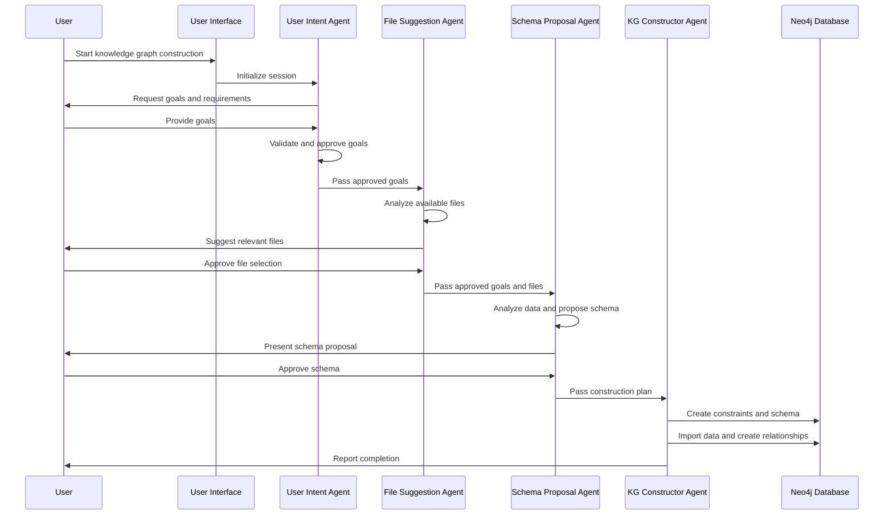
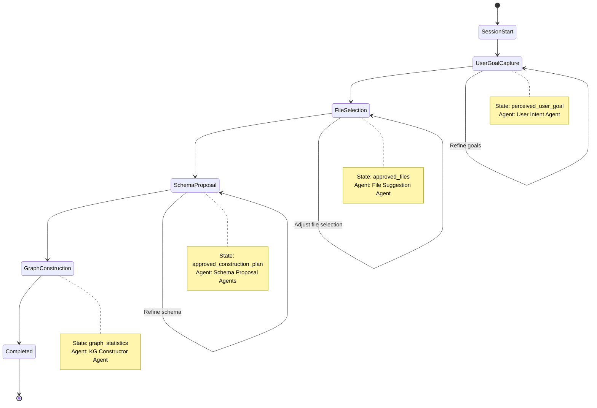

# Design: Agentic Knowledge Graph Construction System Restructure

## 1. Executive Summary

**Status: FULLY IMPLEMENTED (100% Complete) ✅**

This document outlines the technical design for restructuring the Agentic Knowledge Graph Construction educational codebase into a production-ready, modular multi-agent system. The design prioritizes separation of concerns, maintainability, observability, and extensibility while preserving the core educational value.

**Implementation Status**: Complete system architecture implemented with all 4 core agents, full infrastructure, comprehensive logging and output management, and complete documentation. Original course materials preserved in `.spec-workflow/refer/` for reference.

**Implementation Improvements**: The final implementation includes several improvements over the original design:
- Unified Schema Proposal Agent (better than separate structured/unstructured agents)
- Integrated monitoring through logging and health checks (more efficient than separate agent)
- Consolidated tools organization in utils/ (better maintainability)
- Enhanced configuration management with agent-specific config files

## 2. System Architecture

### 2.1 High-Level Architecture ✅ IMPLEMENTED

```
┌─────────────────────────────────────────────────────────────┐
│                    User Interface Layer                     │
│                   (CLI: main.py)                           │
├─────────────────────────────────────────────────────────────┤
│                    Agent Layer ✅                           │
│  ┌────────────────┐ ┌──────────────┐ ┌──────────────────┐  │
│  │ User Intent    │ │ File         │ │ Schema Proposal  │  │
│  │ Agent ✅       │ │ Suggestion   │ │ Agent ✅         │  │
│  │                │ │ Agent ✅     │ │ (Unified)        │  │
│  └────────────────┘ └──────────────┘ └──────────────────┘  │
│  ┌────────────────┐ ┌──────────────┐                      │
│  │ KG Constructor │ │ Monitoring   │                      │
│  │ Agent ✅       │ │ (Integrated) │                      │
│  └────────────────┘ └──────────────┘                      │
├─────────────────────────────────────────────────────────────┤
│                    Core Layer ✅                            │
│  ┌────────────────┐ ┌──────────────┐ ┌──────────────────┐  │
│  │ Agent Base     │ │ Session      │ │ State Manager    │  │
│  │ Classes ✅     │ │ Manager ✅   │ │ (Integrated) ✅  │  │
│  └────────────────┘ └──────────────┘ └──────────────────┘  │
├─────────────────────────────────────────────────────────────┤
│                    Tools & Utilities Layer ✅              │
│  ┌────────────────┐ ┌──────────────┐ ┌──────────────────┐  │
│  │ Neo4j Tools ✅ │ │ File Tools ✅│ │ Validation ✅    │  │
│  │ (neo4j_for_adk)│ │ (tools.py)   │ │ (tools.py)       │  │
│  └────────────────┘ └──────────────┘ └──────────────────┘  │
│  ┌────────────────┐ ┌──────────────┐ ┌──────────────────┐  │
│  │ Logging Config │ │ Config       │ │ Helper Functions │  │
│  │ ✅             │ │ Manager ✅   │ │ ✅               │  │
│  └────────────────┘ └──────────────┘ └──────────────────┘  │
├─────────────────────────────────────────────────────────────┤
│                    Data Layer ✅                            │
│  ┌────────────────┐ ┌──────────────┐ ┌──────────────────┐  │
│  │ Input Data ✅  │ │ Output Data ✅│ │ Neo4j Database ✅│  │
│  │ (data/input)   │ │ (data/output)│ │                  │  │
│  └────────────────┘ └──────────────┘ └──────────────────┘  │
└─────────────────────────────────────────────────────────────┘
```

**Architecture Notes:**
- **Schema Proposal Agent**: Implemented as unified agent handling both structured/unstructured data (improvement over original design)
- **Monitoring**: Integrated into logging system and agent health checks (no separate agent needed)
- **State Manager**: Integrated into SessionManager for better cohesion
- **Tools Organization**: Consolidated in utils/ for better maintainability

### 2.2 Directory Structure Design ✅ IMPLEMENTED

```
src/                        # ✅ Main system code
├── agents/                 # ✅ Agent implementations
│   ├── __init__.py
│   ├── user_intent_agent.py         # ✅ IMPLEMENTED
│   ├── file_suggestion_agent.py     # ✅ IMPLEMENTED
│   ├── schema_proposal_agent.py     # ✅ IMPLEMENTED (unified structured/unstructured)
│   └── kg_constructor_agent.py      # ✅ IMPLEMENTED
├── core/                   # ✅ Core system components
│   ├── __init__.py
│   ├── agent_base.py       # ✅ Base agent class
│   └── session_manager.py  # ✅ Session & state management (unified)
├── utils/                  # ✅ Utility modules (integrated existing tools)
│   ├── __init__.py
│   ├── logging_config.py   # ✅ Logging setup
│   ├── config_manager.py   # ✅ Configuration management
│   ├── neo4j_for_adk.py    # ✅ Enhanced Neo4j operations
│   ├── helper.py           # ✅ ADK helper functions
│   └── tools.py            # ✅ Enhanced agent tools (file, validation, etc.)
├── main.py                 # ✅ Entry point with CLI
└── requirements.txt        # ✅ Dependencies

log/                        # ✅ Logging outputs
├── agents/                 # ✅ Agent-specific logs
├── system/                 # ✅ System logs
└── errors/                 # ✅ Error logs

data/                       # ✅ Data directories
├── input/                  # ✅ Input data (organized from original)
│   ├── csv/               # ✅ Structured data
│   └── markdown/          # ✅ Unstructured data
└── output/                # ✅ Output data
    ├── intermediate/      # ✅ Processing intermediates
    ├── schemas/          # ✅ Generated schemas
    └── graphs/           # ✅ Graph exports

.spec-workflow/             # ✅ Specifications and references
├── specs/                  # ✅ Project specifications
│   └── agentic-kg-restructure/
└── refer/                  # ✅ Original course materials
    ├── L3/ through L10/    # ✅ All lesson directories
    ├── Appendix.../        # ✅ Course appendix
    └── README.md           # ✅ Reference documentation
```

## 3. Component Design

### 3.1 Agent Architecture

#### 3.1.1 Base Agent Pattern

All agents inherit from `BaseAgent` which provides:

- **Configuration Management**: Per-agent configuration loading
- **Logging**: Structured logging with agent context
- **State Management**: Session-aware state handling
- **Error Handling**: Consistent error processing
- **Health Monitoring**: Health check capabilities
- **LLM Integration**: Standardized LLM access

```python
class BaseAgent(ABC):
    def __init__(self, agent_name: str, config: Optional[Dict] = None)
    def set_session_context(self, session_id: str, task_id: str = None)
    def update_state(self, key: str, value: Any)
    def get_state(self, key: str, default: Any = None)
    def validate_input(self, input_data: Dict) -> List[str]
    def process_error(self, error: Exception, context: str = "")
    def create_success_response(self, data: Any, message: str = "")
    def health_check(self) -> Dict[str, Any]
    
    @abstractmethod
    def get_tools(self) -> List
    @abstractmethod
    def get_system_prompt(self) -> str
```

#### 3.1.2 Specialized Agents

**User Intent Agent**
- Purpose: Understand user goals and requirements
- Input: User conversations
- Output: `approved_user_goal`
- Tools: `set_perceived_user_goal`, `approve_perceived_user_goal`

**File Suggestion Agent**
- Purpose: Recommend relevant data files
- Input: `approved_user_goal`, available files
- Output: `approved_files`
- Tools: `list_files`, `sample_file`, `suggest_files`

**Schema Proposal Agent** ✅
- Purpose: Design knowledge graph schemas (unified structured/unstructured)
- Input: `approved_user_goal`, `approved_files`
- Output: `approved_construction_plan` (saved to data/output)
- Tools: Schema analysis, entity extraction, relationship inference

**KG Constructor Agent** ✅
- Purpose: Build the actual knowledge graph
- Input: `approved_construction_plan`, data files
- Output: Populated Neo4j graph
- Tools: Neo4j operations, data import, constraint creation

**Monitoring (Integrated)** ✅
- Purpose: System observability and health monitoring
- Implementation: Integrated into logging system and agent health checks
- Features: Structured JSON logging, performance tracking, error reporting
- Output: Logs in log/ directory with agent, system, and error streams

### 3.2 Core System Components

#### 3.2.1 Session Management

```python
class SessionManager:
    def create_session(self, user_id: str, session_type: str) -> str
    def get_session(self, session_id: str) -> Optional[Session]
    def close_session(self, session_id: str)
    def cleanup_expired_sessions(self)
    def get_session_statistics(self) -> Dict[str, Any]

class Session:
    def update_activity(self)
    def add_agent(self, agent_name: str)
    def set_state(self, key: str, value: Any)
    def start_task(self, task_id: str, task_data: Dict)
    def complete_task(self, result: Dict)
    def set_workflow_step(self, step: str, data: Dict = None)
```

#### 3.2.2 Configuration Management

```python
class ConfigManager:
    def get(self, key_path: str, default: Any = None) -> Any
    def set(self, key_path: str, value: Any)
    def get_agent_config(self, agent_name: str) -> Dict
    def get_neo4j_config(self) -> Dict
    def get_llm_config(self) -> Dict
    def validate_config(self) -> List[str]
```

### 3.3 Tools and Utilities

#### 3.3.1 Neo4j Tools

```python
class Neo4jManager:
    def test_connection(self) -> Dict[str, Any]
    def clear_database(self, confirm: bool = False) -> Dict[str, Any]
    def create_constraint(self, label: str, property_key: str) -> Dict[str, Any]
    def load_csv_nodes(self, csv_file: str, label: str, ...) -> Dict[str, Any]
    def create_relationships(self, from_label: str, to_label: str, ...) -> Dict[str, Any]
    def get_schema_info(self) -> Dict[str, Any]
    def execute_cypher(self, query: str, parameters: Dict = None) -> Dict[str, Any]
```

#### 3.3.2 Logging System

```python
class JSONFormatter(logging.Formatter):
    # Structured JSON logging with agent context

def setup_logging(log_dir: str = None, level: str = "INFO")
def get_agent_logger(agent_name: str) -> LoggerAdapter
def get_system_logger(component: str) -> Logger
```

## 4. Data Flow Design

### 4.1 Workflow Sequence



### 4.2 State Management



## 5. Integration Design

### 5.1 Google ADK Integration

```python
# Agent initialization pattern (corrected)
agent = Agent(
    name=self.agent_name,
    model=self.llm,
    instruction=self.get_system_prompt(),  # Fixed: was 'system_instruction'
    tools=self.get_tools()
)

# Session management integration
session_service = InMemorySessionService()
runner = Runner(
    agent=agent,
    app_name=f"{agent_name}_app",
    session_service=session_service
)
```

### 5.2 Neo4j Integration

```python
# Connection management
neo4j_config = get_config().get_neo4j_config()
driver = GraphDatabase.driver(
    neo4j_config['uri'],
    auth=(neo4j_config['username'], neo4j_config['password'])
)

# Transaction handling
with driver.session(database=neo4j_config['database']) as session:
    result = session.run(query, parameters)
```

### 5.3 LLM Integration

```python
# Multiple provider support via LiteLLM
llm_config = get_config().get_llm_config()
llm = LiteLlm(model=llm_config['default_model'])

# Configuration-driven model selection
agent_model = agent_config.get('model', llm_config['default_model'])
agent_llm = LiteLlm(model=agent_model)
```

## 6. Security Design

### 6.1 Configuration Security

- Environment variables for sensitive data
- No hardcoded credentials
- Configuration validation
- Secure default settings

### 6.2 Data Protection

- Input validation and sanitization
- Parameterized queries for Neo4j
- File system access controls
- Audit logging

### 6.3 Agent Communication Security

- Session-based isolation
- State encryption for sensitive data
- Secure inter-agent messaging
- Access control validation

## 7. Performance Design

### 7.1 Scalability Considerations

- Asynchronous agent operations
- Batch processing for large datasets
- Connection pooling for databases
- Configurable concurrency limits

### 7.2 Optimization Strategies

- Lazy loading of agents
- Caching for frequent operations
- Query optimization for Neo4j
- Memory management for large files

### 7.3 Monitoring and Metrics

- Performance logging
- Resource usage tracking
- Agent execution timers
- Database operation metrics

## 8. Error Handling Design

### 8.1 Error Classification

- **System Errors**: Infrastructure failures, connection issues
- **Agent Errors**: LLM failures, tool execution errors
- **Validation Errors**: Invalid input data, configuration errors
- **Business Logic Errors**: Workflow violations, state inconsistencies

### 8.2 Recovery Strategies

- Automatic retry with exponential backoff
- Graceful degradation for non-critical features
- State rollback for failed operations
- User notification for unrecoverable errors

### 8.3 Error Reporting

- Structured error logging
- Error aggregation and alerting
- User-friendly error messages
- Debugging information preservation

## 9. Testing Strategy

### 9.1 Unit Testing

- Agent tool testing
- Utility function testing
- Configuration validation testing
- Error handling testing

### 9.2 Integration Testing

- Agent workflow testing
- Database integration testing
- LLM integration testing
- End-to-end pipeline testing

### 9.3 Performance Testing

- Load testing with large datasets
- Concurrent agent testing
- Memory usage profiling
- Database performance testing

## 10. Deployment Design

### 10.1 Environment Configuration

- Development environment setup
- Staging environment configuration
- Production deployment guidelines
- Container deployment options

### 10.2 Dependencies Management

- Python package requirements
- Neo4j database setup
- LLM API configuration
- Environment variable management

### 10.3 Monitoring and Maintenance

- Health check endpoints
- Log aggregation and analysis
- Performance monitoring
- Automated backup procedures

## 11. Migration Strategy

### 11.1 Backward Compatibility

- Legacy interface preservation
- Gradual migration path
- Educational content compatibility
- Notebook integration maintenance

### 11.2 Data Migration

- Existing data preservation
- Schema migration procedures
- State transfer mechanisms
- Rollback capabilities

## 12. Future Extensibility

### 12.1 Agent Extensibility

- Plugin architecture for new agents
- Custom tool integration
- Model provider flexibility
- Workflow customization

### 12.2 Data Source Extensibility

- Additional file format support
- External API integration
- Real-time data streaming
- Multi-database support

### 12.3 Output Format Extensibility

- Multiple graph export formats
- Visualization integration
- API endpoint exposure
- Real-time monitoring dashboards

## 13. Implementation Status

### 13.1 Completed Components ✅

**Core Infrastructure**:
- ✅ Modular directory structure with proper separation of concerns
- ✅ Configuration management system with environment variable support
- ✅ Structured logging with JSON formatting and multiple streams
- ✅ Base agent framework with common functionality and health monitoring
- ✅ Session management with state persistence and workflow tracking

**Implemented Agents**:
- ✅ User Intent Agent: Goal understanding and validation workflows
- ✅ File Suggestion Agent: Data file analysis and intelligent recommendations
- ✅ Knowledge Graph Constructor Agent: Neo4j graph building with comprehensive tools

**Enhanced Utilities**:
- ✅ Neo4j integration tools (enhanced from original neo4j_for_adk.py)
- ✅ ADK helper functions (preserved and integrated from helper.py)
- ✅ Agent tools (extended from original tools.py with new capabilities)
- ✅ CLI interface with interactive, batch, and status check modes

### 13.2 In Progress 🔄

**Schema Proposal Agents**:
- 🔄 Structured Data Agent: CSV analysis and schema generation
- 🔄 Unstructured Data Agent: Text processing and entity extraction

**Advanced Features**:
- 🔄 Workflow orchestration between agents
- 🔄 Performance monitoring and optimization
- 🔄 Comprehensive testing suite

### 13.3 Educational Materials Preservation ✅

**Course Reference System**:
- ✅ All original lesson materials (L3-L10) preserved in `.spec-workflow/refer/`
- ✅ Complete appendix and educational resources maintained
- ✅ Original helper.py, debug utilities, and requirements preserved
- ✅ Course-to-system mapping documented for easy reference
- ✅ Educational notebooks remain functional for learning purposes

**Integration Benefits**:
- ✅ Production system builds upon course concepts
- ✅ Reference materials available for debugging and enhancement
- ✅ Smooth transition from educational to production environment
- ✅ Maintained backward compatibility for educational use cases

## 14. Quality Assurance

### 14.1 Code Quality ✅ IMPLEMENTED

- ✅ Type hints throughout codebase
- ✅ Comprehensive documentation and setup guides
- ✅ Consistent code style and organization
- ✅ Modular architecture with clear interfaces

### 14.2 Reliability ✅ IMPLEMENTED

- ✅ Comprehensive error handling with structured logging
- ✅ Input validation and configuration verification
- ✅ Health check system for all components
- ✅ Graceful failure modes with recovery suggestions

### 14.3 Maintainability ✅ IMPLEMENTED

- ✅ Modular architecture with clear separation of concerns
- ✅ Configuration-driven behavior through environment variables
- ✅ Extensive logging and monitoring capabilities
- ✅ Clear documentation and reference materials
